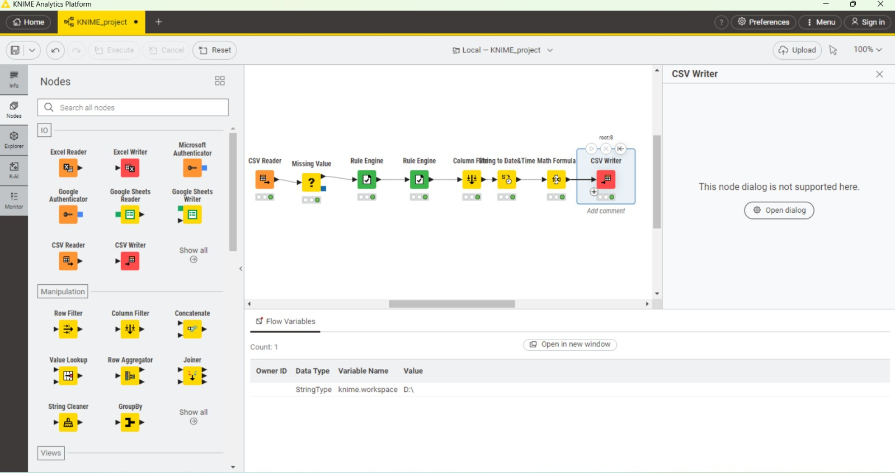
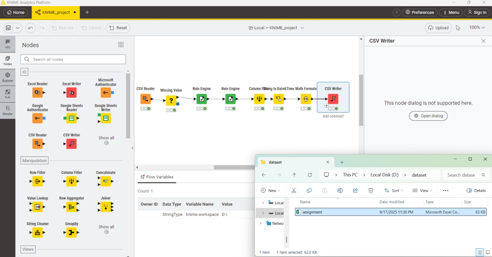
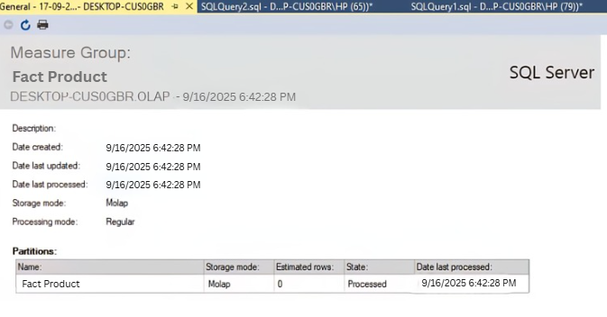

# BI_Assignment

#### Prepared by Gunti Samhitha (160122737147) and M Sudha Jennifer (160122737150) from IT 3 , 4th year
#### GitHub Link: https://github.com/Samhitha1416/PowerBI_Dashboard

## Question 1: Perform ETL for Retail Data

KNIME Workflow – Data Preprocessing and Export

This workflow demonstrates how raw data is read, cleaned, transformed, and exported using the KNIME Analytics Platform.

Workflow Steps:

1. CSV Reader – Imports the dataset (in this case, an Excel file converted to CSV).
2. Missing Value Node – Handles missing values by either replacing them with defaults or removing incomplete records.
3. Rule Engine – Applies custom logic to create new columns or transform existing data based on conditions.
4. Rule Engine (second use) – Adds additional transformation rules to refine the dataset further.
5. Column Filtering – Keeps only the required attributes, removing unnecessary columns.
6. Date&Time Math Formula – Performs operations on date/time fields (e.g., calculating durations, differences, or new time-based features).
7. CSV Writer – Exports the processed dataset into a new CSV file for further use.

How It Was Created

1. Open KNIME Analytics Platform.
2. Drag and drop nodes from the Node Repository (CSV Reader, Missing Value, Rule Engine, etc.) into the workflow editor.
3. Connect the nodes sequentially to define the data flow.
4. Configure each node:
    -Set input file path in CSV Reader.
    -Define replacement rules in Missing Value.
    -Write transformation rules in Rule Engine.
    -Select relevant attributes in Column Filter.
    -Apply date/time formulas in Date&Time Math Formula.
    -Save final data with CSV Writer.
5. Execute the workflow step by step until the final dataset is generated and saved.

---
## Question 2: Design OLAP Cube

 

An OLAP (Online Analytical Processing) cube is used for multidimensional analysis of the data.  
It allows slicing, dicing, and drilling down into data across different dimensions.

The Fact Product measure group is part of the OLAP cube created in SQL Server Analysis Services (SSAS). A measure group is built from a fact table in the data warehouse and contains the aggregated numerical values (measures) that can be analyzed across different dimensions. In this case, the source fact table is FactProduct, which stores product-related sales data.

How it was created

1. In SQL Server Data Tools (SSDT) or SSAS, create a new cube and select the FactProduct table as the fact table.
2. Define the measures (e.g., Product Count, Sales Amount, Quantity Sold) from the numeric columns of the fact table.
3. Add dimension relationships by linking the FactProduct table with related dimension tables such as Product, Date, and Customer.
4. Deploy the cube to the SSAS server.
5. Process the cube so that the Fact Product measure group is populated with data in MOLAP storage mode.

After deployment and processing, the Fact Product measure group becomes queryable in the OLAP cube, allowing users to slice and dice product measures across different dimensions.

---

## Question 3: Design Star Schema

### 1. Fact Table (Sales)
- **OrderID:** Unique sales transaction ID  
- **CustomerID:** Links to Customers table  
- **DateID:** Links to Dates table  
- **ProductID:** Links to Products table  
- **Quantity:** Number of items sold  
- **Price:** Price per item  
- **TotalSales:** Calculated as Quantity × Price (main metric)  

### 2. Dimension Tables
- **Customers**
  - CustomerID (PK), CustomerName, CustomerAge, CustomerCity  
- **Products**
  - ProductID (PK), ProductName, Category, Price  
- **Dates**
  - DateID (PK), Date, Month, Year  

### 3. Relationships
- **One-to-Many**:
  - One customer → many sales  
  - One product → many sales  
  - One date → many sales

  
